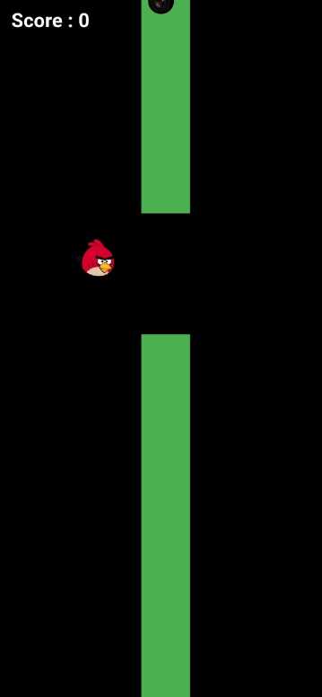
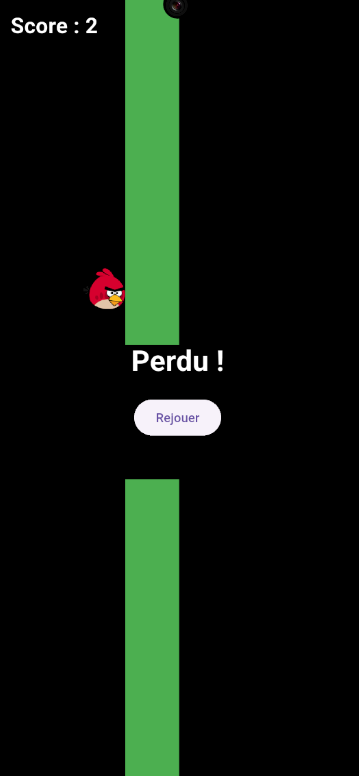

# 🐦 Flutter Bird

Un petit jeu mobile inspiré de Flappy Bird, codé avec ❤️ en **Flutter + Flame**.  
Compatible **Android**, **iOS**, **Web**, **Windows**, **macOS** et **Linux**.

---

## 📸 Aperçu

| En jeu                       | Écran de défaite       |
| ---------------------------- | ---------------------- |
|  |  |

---

## 🎮 Principe du jeu

- Tu incarnes un oiseau.
- Appuie sur l’écran pour le faire voler.
- Évite les obstacles verts (tuyaux).
- Chaque tuyau évité te donne **1 point**.
- Si tu touches un tuyau ou sors de l'écran → **Perdu**.
- Un bouton **Rejouer** apparaît pour relancer immédiatement la partie.

---

## 🚀 Tester le jeu

### 1. Cloner le projet

```
git clone https://github.com/Thesirix/Flutter_Bird.git
cd Flutter_Bird
```

### 2. Télécharger les dépendances

```
flutter pub get
```

### 3. Lancer l’application

```
flutter run
```

⚠️ Si tu modifies des fichiers dans `assets/`, pense à faire :

```
flutter clean
flutter pub get
```

---

## 🖼️ Personnaliser l’image de l’oiseau

1. Place ton image dans le dossier `assets/images` (par exemple `assets/images/bird.png`)
2. Dans le code (`Bird`), charge l’image avec :

```
sprite = await Sprite.load('bird.png');
```

3. Dans `pubspec.yaml`, vérifie la déclaration suivante :

```
flutter:
  assets:
    - assets/images/bird.png
```

4. Puis exécute :

```
flutter pub get
```

---

## 🛠️ Fonctionnalités

- Tap pour voler
- Détection de collision
- Génération automatique d’obstacles
- Score en temps réel
- Game Over + bouton **Rejouer**
- Image de l’oiseau personnalisable
- Multiplateforme (mobile, web, desktop)

---

## 🧩 Technologies

- Flutter
- Flame Engine
- Dart

---

## ✅ Plateformes supportées

| Plateforme          | Support |
| ------------------- | ------- |
| Android             | ✅      |
| iOS                 | ✅      |
| Web                 | ✅      |
| Windows/macOS/Linux | ✅      |
