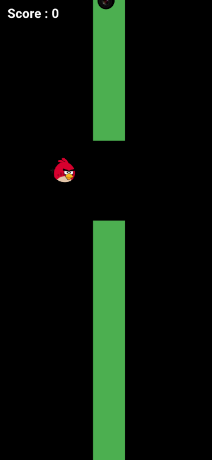
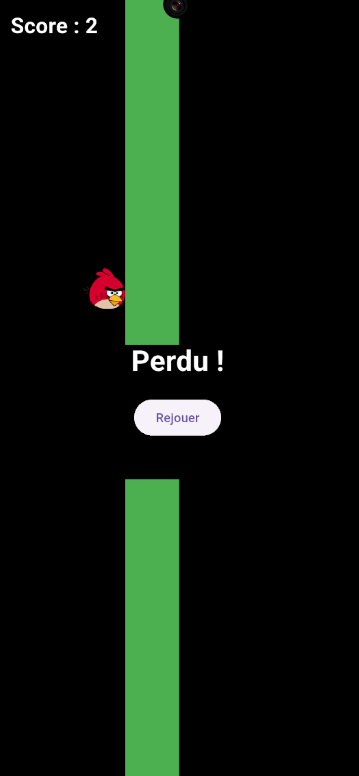

# 🐦 Flutter Bird

A small mobile game inspired by Flappy Bird, coded with ❤️ in **Flutter + Flame**.
Compatible with **Android**, **iOS**, **Web**, **Windows**, **macOS**, and **Linux**.

---

## 📸 Preview

| In Game                      | Game Over Screen       |
| ---------------------------- | ---------------------- |
|  |  |

---

## 🎮 Gameplay

- You play as a bird.
- Tap the screen to make it fly.
- Avoid the green obstacles (pipes).
- Each pipe passed gives you **1 point**.
- If you hit a pipe or go off-screen → **Game Over**.
- A **Replay** button appears to restart the game immediately.

---

## 🚀 How to Run

### 1. Clone the project

```bash
git clone [https://github.com/Thesirix/Flutter_Bird.git](https://github.com/Thesirix/Flutter_Bird.git)
cd Flutter_Bird
```

### 2. Install dependencies

```bash
flutter pub get
```

### 3. Launch the app

```bash
flutter run
```

⚠️ If you modify files in `assets/`, remember to run:

```bash
flutter clean
flutter pub get
```

---

## 🖼️ Customize the Bird Image

1. Place your image in the `assets/images` folder (e.g., `assets/images/bird.png`).
2. In the code (`Bird` class), load the image using:

```dart
sprite = await Sprite.load('bird.png');
```

3. In `pubspec.yaml`, verify the following declaration:

```yaml
flutter:
  assets:
    - assets/images/bird.png
```

4. Then execute:

```bash
flutter pub get
```

---

## 🛠️ Features

- Tap to fly
- Collision detection
- Automatic obstacle generation
- Real-time scoring
- Game Over + **Replay** button
- Customizable bird sprite
- Cross-platform (mobile, web, desktop)

---

## 🧩 Technologies

- Flutter
- Flame Engine
- Dart

---

## ✅ Supported Platforms

| Platform            | Support |
| ------------------- | ------- |
| Android             | ✅      |
| iOS                 | ✅      |
| Web                 | ✅      |
| Windows/macOS/Linux | ✅      |
